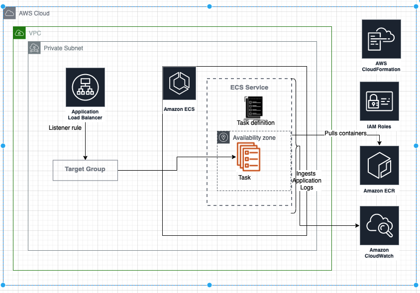

# API-service-provider
Server providing a basic http  `metadata`, `health` and root endpoints. 
## Highlights
- API server exposes basic endpoints `/health`, `/metadata` and root `/`.
- Repository follows [The Twelve-Factor App](https://12factor.net) approach
- Build and deploy follows [3 musketeers](https://amaysim.engineering/the-3-musketeers-how-make-docker-and-compose-enable-us-to-release-many-times-a-day-e92ca816ef17) approach of docker-compose, dockerfile and Makefile
- **Node-js** as programming language
- Code is built, linted, unit tested, integration tested and pushed to artifact( specified or by default ECR)
- Deployed to **AWS ECS-Fargate**. Exposes the ALB endpoint to connect to the API endpoint
- **Terraform** for infra structure as code 
- **Buildkite** pipeline for CI/CD. Pipeline builds,tests, build and push the image and deploy to AWS.

## API endpoint
The endpoint exposes following 
- default root endpoint 
- metadata endpoint returning details in json format
```
{
  "apiServiceProvider": [
    {
      "version": "1.0.0",
      "description": "framework to host api endpoint",
      "lastCommit": "4c03d6c"
    }
  ]
}
```
- health endpoint returns status of the API endpoint in json format
```
{
  "status": "UP"
}
```

# Guide
## Assumptions/Dependencies
Repository follows `3 musketeers` approach, hence it has very minimal dependencies
* **Docker Engine**: Make target relies on docker running on the system.
* **GNU make**: All the commands are run through Makefile targets. Makefile targets reflect the application life cycle.
* **AWS access**: Deployment assumes access to the target AWS account and all the required AWS access config is done.
## Usage

```
# 1. Build, lint and unit testing the code. Test generates the code coverage report
make build

# 2. Run integration tests
make test

# 3. Build docker image
make build_image

# 4. Tag image: Tags with the artifact url and path. If artifact url is not provided, then it's defaulted to ECR
make tag_image

# 5. Push image: Pushes the image to specified artifact
make push_image

# 6. Deployment: Infrastructure deployed using terraform. Two steps of terraform: plan and deploy
make infra_plan
make infra_deploy

# 7. Destroy of infrastructure deployment
make destroy

# 8. If ECR as repository, then commands to login and create the artifact
make ecr_login
make ecr_create_repository
```

## Dev commands

```
# 1. Fix the linting error in the code
make lint_fix

# 2. Fix terraform formatting errors
make infra_format

#3. Diagnose deployment errors/failures
make infra_shell
```

# Repository walk-through
## Nodejs as programming language
Reason for choosing node-js programming language
* Been using node from last couple of years
* Ease of exposing REST endpoint. 
* Testing: Like any other programming language, can easily be broken into smaller components. Hence the testing can be done in smaller units
* Package management: Package management is pretty mature.

## Source code

* `./src` directory host the source code.
* **Linting**: follows ES-lint coding standards
* Code broken into self explanatory, smaller testable units.
## Unit Testing
* `./test` directory host unit tests of the source code
* Testing: `Jest` as the framework for testing
* Directory structure follows the `src` code structure
* Coverage report generated at the end of testing

## Integration Testing
* `integration-tests` directory host integrations tests
* Both application container and test container are run in the same docker-network. This helps the test container communicate with the application container
* Test verifies `/health`, `/metadata`, root and invalid endpoints

## Deployment and Infrastructure 
* **AWS** as cloud service provider
* Terraform for infra structure as code
* `infra` directory hosts the code
* AWS ECS Fargate to host the task
* API server is behind the `Internal Load balancer`

## CI/CD

* **Buildkite** for CI-CD pipeline
* Invokes make targets for build, push and deploy
* **Assumption**: Buildkite agent names for build and deployment are assumed. This needs to fixed when connecting to buildkite.

# AWS Deployment

- ECS Cluster using fargate
- Task definition hosts API server container definitions
- Docker image pulled from Artifact, defaults to ECR.
- Application Load Balancer(**ALB**) forwards to TargetGroup and exposes **private** DNS.
- Target Group does health check on service port which verifies the health of the application.
- Containers are run in **private** subnet
- Container logs updated to **CloudWatch** log group

## Security:

### Internal ALB: 
- Ideally API endpoints(in case of multiple servers) should be internal and backed with public BFF endpoint
- For simplicity ALB is not associated to ACM certificate, hence exposing HTTP endpoint
- To avoid the attack factor, ALB is **internal** and is not exposed to the internet
- For testing the deployment: Connect to a bastion-box within the VPC and hit the endpoint

### Security Group
- ALB security group allows only port 80
- Source should be within the VPC


## Architecture


                
# Enhancements to consider

## Deployment testing

* Due to security reasons explained before ALB is hosted in private subnet hence will not be reachable outside the VPC.  Also security group only allows origin to be within VPC.
* Since ALB is unreachable, testing becomes difficult to run from test machine or buildkite agent

### Approach: Lambda to run deployment testing.
To reach the internal ALB, test needs to be run with the VPC. Best option be will be to trigger the lambda and hit the internal ALB host-name and verify the deployment


## Version bump

* Every new build triggered in master branch should bump the version present in `Package.json`
* [Conventional commit](https://www.conventionalcommits.org/en/v1.0.0/): To detect which one of `major`, `minor` or `patch` version to be bumped. 
